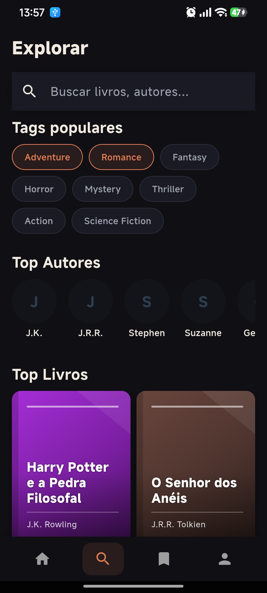

<div align="center">

# 📚 Library App

**Aplicativo mobile de leitura digital desenvolvido em Flutter**

[](https://flutter.dev)
[](https://dart.dev)
[](#arquitetura)
[](#stack-técnica)

</div>

---

## Screenshots

<div align="center">

<table>
  <tr>
    <td align="center">
      
      <br/><sub><b>Detalhe do Livro</b></sub>
    </td>
    <td align="center">
      
      <br/><sub><b>Busca & Explorar</b></sub>
    </td>
    <td align="center">
      
      <br/><sub><b>Perfil do Usuário</b></sub>
    </td>
  </tr>
</table>

</div>

---

## Sobre o Projeto

Library App é um aplicativo de leitura digital construído como projeto de portfólio para demonstrar domínio de arquitetura de software, padrões de projeto e boas práticas no desenvolvimento mobile com Flutter.

O app conta com catálogo de 20 livros clássicos, leitor imersivo com controle de fonte e tema, sistema de favoritos, autenticação e perfil completo — tudo sem dependência de backend, substituível por qualquer API real sem alterar domain ou presentation.

---

## Funcionalidades

| Feature | Descrição |
|---|---|
| 🔐 **Autenticação** | Login por e-mail/senha ou Google, registro com validação, rotas protegidas |
| 🏠 **Home** | Destaque, continue lendo com progresso, recomendações por avaliação |
| 🔍 **Busca** | Pesquisa por título/autor, filtros por tag, top autores |
| 📖 **Leitor** | Modo imersivo, 3 temas (claro/sépia/escuro), controle de fonte, progresso |
| 🔖 **Favoritos** | Adicionar/remover com feedback imediato, lista persistente em sessão |
| 👤 **Perfil** | Edição de nome, alteração de senha, notificações, configurações |

---

## Arquitetura

O projeto segue **Clean Architecture** com separação rígida em 3 camadas por feature:

```
lib/
├── core/
│   ├── constants/       # Design system (cores, tipografia, espaçamento)
│   ├── di/              # Injeção de dependência (get_it)
│   ├── errors/          # Failures e Exceptions tipados
│   ├── mock/            # Dados mock substituíveis por API real
│   └── usecases/        # Contrato base UseCase<Type, Params>
│
└── features/
    ├── auth/            # Login, registro, guard de rotas
    │   ├── data/        # AuthMockDatasource, AuthRepositoryImpl
    │   ├── domain/      # UserEntity, AuthRepository, 6 usecases
    │   └── presentation/# AuthBloc, LoginPage, RegisterPage
    │
    ├── books/           # Catálogo, home, busca, leitor
    │   ├── data/        # BookMockDatasource, models
    │   ├── domain/      # BookEntity, 6 usecases
    │   └── presentation/# HomeBloc, SearchBloc, 6 pages
    │
    ├── bookmarks/       # Sistema de favoritos
    │   ├── data/        # BookmarksMockDatasource
    │   ├── domain/      # 3 usecases (add, remove, get)
    │   └── presentation/# BookmarksBloc, BookmarksPage
    │
    └── profile/         # Configurações e perfil do usuário
        └── presentation/# ProfileBloc, 5 pages
```

### Fluxo de dados

```
Widget → Event → BLoC → UseCase → Repository → Datasource
                   ↓
               Either<Failure, T>
                   ↓
               State → Widget rebuild
```

---

## Stack Técnica

| Pacote | Versão | Uso |
|---|---|---|
| `flutter_bloc` | ^9.0 | Gerenciamento de estado (BLoC pattern) |
| `get_it` | ^8.0 | Injeção de dependência |
| `dartz` | ^0.10 | Programação funcional — `Either<Failure, T>` |
| `flutter_modular` | ^6.0 | Roteamento declarativo com route guards |
| `google_fonts` | ^6.2 | Playfair Display · Inter · Lora |
| `shimmer` | ^3.0 | Loading skeleton em listas |
| `flutter_staggered_animations` | ^1.1 | Animações escalonadas |
| `mocktail` | ^1.0 | Mock de repositórios em testes unitários |

---

## Design System

Sistema de design próprio implementado em `core/constants/`, com suporte completo a **dark mode** e **light mode**.

| Token | Light | Dark |
|---|---|---|
| Background | `#F8F5F0` off-white quente | `#0F0F14` |
| Accent | `#C0392B` carmesim | `#E07B54` terracota |
| Text Primary | `#1A1A2E` | `#F0EAE0` |
| Surface | `#FFFFFF` | `#1A1A24` |

**Tipografia:** Playfair Display (headings) · Inter (body) · Lora (leitor serif)

**Espaçamento:** grid de 8px — `xs=4 · sm=8 · md=16 · lg=24 · xl=32 · xxl=48`

---

## Leitor Imersivo

- Tela cheia com `SystemUiMode.immersiveSticky`
- Controles que aparecem/somem ao toque com `AnimationController`
- Auto-hide após 4 segundos de inatividade
- Progresso sincronizado com `ScrollController`
- 20 trechos literários em Português (5–7 parágrafos cada)

**Configurações:** tamanho de fonte (12–24pt) · Serif / Sans-serif · Claro / Sépia / Escuro

---

## Como Executar

**Pré-requisitos:** Flutter 3.x · Dart 3.x · Android SDK

```bash
# Clonar
git clone https://github.com/gustasl01/library-app
cd library-app

# Instalar dependências
flutter pub get

# Rodar em modo debug
flutter run

# Build APK release
flutter build apk --release

# Análise estática
flutter analyze
```

> O app funciona **completamente offline**. Nenhuma configuração de backend necessária.

---

## Substituindo Mock por API Real

```dart
// core/di/injection_container.dart — única linha a mudar por feature
sl.registerLazySingleton<BookRemoteDatasource>(
  () => BookMockDatasource(),           // atual (offline)
  // () => BookSupabaseDatasource(sl()) // produção
);
```

---

## Conceitos Demonstrados

```
✅ Clean Architecture   — separação Domain / Data / Presentation
✅ BLoC Pattern         — 5 BLoCs com eventos e estados tipados
✅ Either<Failure, T>   — tratamento funcional de erros (dartz)
✅ Dependency Injection — singleton vs factory com get_it
✅ Route Guards         — autenticação declarativa com flutter_modular
✅ Custom Design System — cores, tipografia e espaçamento próprios
✅ Dark / Light Mode    — suporte completo em todas as telas
✅ CustomPainter        — geração procedural de capas em runtime
✅ AnimationController  — SlideTransition + FadeTransition
✅ SliverAppBar         — header expansível na tela de detalhe
✅ ScrollController     — progresso de leitura em tempo real
✅ SystemChrome         — modo imersivo no leitor
✅ Shimmer Loading      — skeleton em todas as listas
```

---

<div align="center">

Desenvolvido por **Gustavo Santos**

[](https://www.linkedin.com/in/gustavo-santos)

</div>
